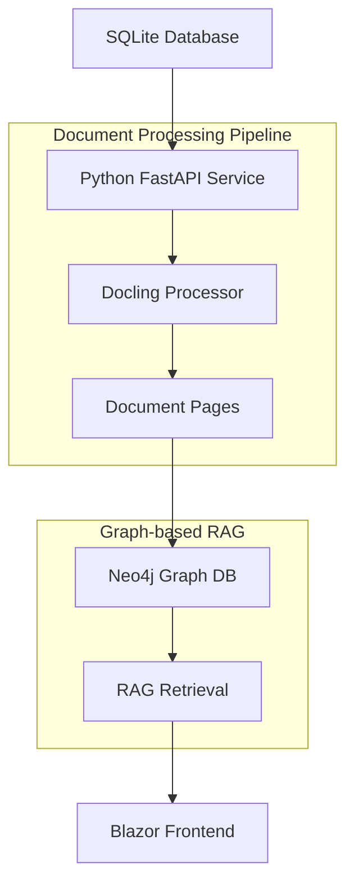

# RAG Implementation Plan - Document Processing with Docling

## Overview

This document outlines the implementation plan for Retrieval Augmented Generation (RAG) functionality in AspireAI, focusing on document processing using docling and Neo4j as the graph repository for advanced retrieval strategies.

## Architecture Overview



## Technology Stack

- **Document Processing**: Docling (Python)
- **API Layer**: FastAPI (Python)
- **Graph Database**: Neo4j (Container)
- **Frontend**: Blazor (.NET 10)
- **Orchestration**: .NET Aspire

## Phase 1: Database Schema and Setup

### 1.1 Dependencies Update

**File**: `src/AspireApp.PythonServices/requirements.txt`

```txt
anyio
fastapi
uvicorn
# Document processing
docling
docling-core
docling-ibm-models
# Database connections
sqlite3
neo4j
# Additional utilities
pypdf2
python-multipart
pydantic
aiofiles
```

### 1.2 SQLite Database Schema

**Expected Tables in `/database/data-resources.db`:**

```sql
-- Original uploaded documents
CREATE TABLE documents (
    id INTEGER PRIMARY KEY AUTOINCREMENT,
    filename TEXT NOT NULL,
    original_filename TEXT NOT NULL,
    file_path TEXT NOT NULL,
    file_size INTEGER,
    mime_type TEXT,
    upload_date DATETIME DEFAULT CURRENT_TIMESTAMP,
    processed BOOLEAN DEFAULT FALSE,
    processing_status TEXT DEFAULT 'pending'
);

-- Document processing results
CREATE TABLE processed_documents (
    id INTEGER PRIMARY KEY AUTOINCREMENT,
    document_id INTEGER REFERENCES documents(id),
    docling_document_path TEXT NOT NULL,
    total_pages INTEGER,
    processing_date DATETIME DEFAULT CURRENT_TIMESTAMP,
    processing_metadata TEXT, -- JSON metadata
    neo4j_node_id TEXT -- Reference to Neo4j node
);

-- Individual document pages
CREATE TABLE document_pages (
    id INTEGER PRIMARY KEY AUTOINCREMENT,
    processed_document_id INTEGER REFERENCES processed_documents(id),
    page_number INTEGER NOT NULL,
    content TEXT NOT NULL,
    page_metadata TEXT, -- JSON metadata (bbox, images, etc.)
    neo4j_node_id TEXT -- Reference to Neo4j page node
);
```

## Phase 2: Document Processing Pipeline

### 2.1 File Structure Organization

```
/app/
??? database/
?   ??? data-resources.db                # SQLite database
??? data/
?   ??? processed/                       # Processed docling documents
?   ?   ??? documents/                   # Document-level files
?   ?       ??? {doc_id}/                # Per-document directory
?   ?           ??? document.json        # Full docling document
?   ?           ??? metadata.json        # Document metadata
?   ?           ??? pages/               # Individual pages
?   ?               ??? page_001.json    # Page 1 content
?   ?               ??? page_002.json    # Page 2 content
?   ?               ??? ...
?   ??? uploads/                         # Temporary upload storage
??? app/
    ??? fastapi.py                       # Main FastAPI app
    ??? models/                          # Pydantic models
    ??? services/                        # Business logic
    ?   ??? database_service.py          # SQLite operations
    ?   ??? docling_service.py          # Document processing
    ?   ??? neo4j_service.py            # Graph operations
    ?   ??? rag_service.py              # RAG functionality
    ??? routers/                         # API endpoints
        ??? documents.py                 # Document management
        ??? processing.py                # Document processing
        ??? rag.py                      # RAG endpoints
```

### 2.2 Neo4j Graph Schema

**Node Types:**
- `Document`: Represents the original document
- `Page`: Represents individual pages
- `Chunk`: Represents semantic chunks within pages
- `Entity`: Named entities extracted from content
- `Topic`: Semantic topics/themes

**Relationship Types:**
- `CONTAINS`: Document contains pages
- `PART_OF`: Page is part of document
- `MENTIONS`: Page/chunk mentions entity
- `RELATES_TO`: Semantic relationships between chunks
- `PRECEDES`: Sequential page/chunk relationships

```cypher
// Example Neo4j schema
CREATE CONSTRAINT doc_id IF NOT EXISTS FOR (d:Document) REQUIRE d.id IS UNIQUE;
CREATE CONSTRAINT page_id IF NOT EXISTS FOR (p:Page) REQUIRE p.id IS UNIQUE;
CREATE CONSTRAINT chunk_id IF NOT EXISTS FOR (c:Chunk) REQUIRE c.id IS UNIQUE;

// Example document structure
(doc:Document {id: "doc_123", filename: "report.pdf", total_pages: 10})
-[:CONTAINS]->(page:Page {id: "page_123_1", page_number: 1, content: "..."})
-[:CONTAINS]->(chunk:Chunk {id: "chunk_123_1_1", content: "...", embedding: [...]})
```

## Phase 3: FastAPI Implementation

### 3.1 Core Service Classes

**Database Service** (`services/database_service.py`):
```python
class DatabaseService:
    def get_document(self, doc_id: int) -> Document
    def get_unprocessed_documents(self) -> List[Document]
    def update_processing_status(self, doc_id: int, status: str)
    def save_processed_document(self, processed_doc: ProcessedDocument)
```

**Docling Service** (`services/docling_service.py`):
```python
class DoclingService:
    def process_document(self, file_path: str) -> DoclingDocument
    def extract_pages(self, docling_doc: DoclingDocument) -> List[PageContent]
    def save_docling_document(self, doc_id: int, docling_doc: DoclingDocument)
```

**Neo4j Service** (`services/neo4j_service.py`):
```python
class Neo4jService:
    def create_document_node(self, document: Document) -> str
    def create_page_nodes(self, pages: List[PageContent], doc_node_id: str)
    def create_relationships(self, doc_id: str, page_ids: List[str])
    def search_similar_content(self, query: str, limit: int = 10)
```

### 3.2 API Endpoints

**Document Processing Endpoints** (`routers/processing.py`):
```python
@router.post("/process-document/{document_id}")
async def process_document(document_id: int)

@router.get("/processing-status/{document_id}")
async def get_processing_status(document_id: int)

@router.post("/process-all")
async def process_all_documents()

@router.get("/processed-documents")
async def list_processed_documents()
```

**RAG Endpoints** (`routers/rag.py`):
```python
@router.get("/search-documents")
async def search_documents(query: str, limit: int = 10)

@router.get("/document-context/{document_id}")
async def get_document_context(document_id: int)

@router.get("/page-content/{page_id}")
async def get_page_content(page_id: int)

@router.post("/semantic-search")
async def semantic_search(query: SemanticQuery)
```

## Phase 4: Neo4j Integration and Advanced RAG

### 4.1 Graph-based Retrieval Strategies

**Simple Vector Search:**
```cypher
// Find similar content using vector similarity
MATCH (c:Chunk)
WHERE c.embedding IS NOT NULL
WITH c, vector.similarity.cosine(c.embedding, $query_embedding) AS similarity
WHERE similarity > 0.7
RETURN c.content, c.page_number, c.document_id, similarity
ORDER BY similarity DESC
LIMIT 10
```

**Multi-hop Relationship Traversal:**
```cypher
// Find related content through entity relationships
MATCH (start:Chunk {id: $chunk_id})
-[:MENTIONS]->(entity:Entity)<-[:MENTIONS]-(related:Chunk)
-[:PART_OF]->(page:Page)
-[:PART_OF]->(doc:Document)
RETURN related.content, page.page_number, doc.filename
ORDER BY related.relevance_score DESC
LIMIT 5
```

**Contextual Page Retrieval:**
```cypher
// Get surrounding context for a specific page
MATCH (target:Page {id: $page_id})
-[:PART_OF]->(doc:Document)
<-[:PART_OF]-(context:Page)
WHERE abs(context.page_number - target.page_number) <= 2
RETURN context.content, context.page_number
ORDER BY context.page_number
```

### 4.2 Why Neo4j Instead of /app/data/index

**Advantages of Neo4j over file-based indexing:**

1. **Complex Relationships**: Neo4j excels at modeling and querying complex relationships between documents, pages, entities, and concepts
2. **Real-time Updates**: Dynamic graph updates without rebuilding entire indices
3. **Multi-hop Queries**: Natural support for finding related content through relationship traversal
4. **Scalability**: Better performance for complex queries as data grows
5. **ACID Compliance**: Transactional consistency for concurrent operations
6. **Rich Query Language**: Cypher provides powerful graph query capabilities
7. **Vector Search**: Native support for vector embeddings and similarity search
8. **Flexible Schema**: Easy to evolve the graph model as requirements change

**File-based index limitations:**
- Static structure requiring rebuilds for updates
- Limited relationship modeling capabilities
- Poor performance for complex multi-dimensional queries
- No transactional consistency
- Difficult to maintain consistency across distributed operations

## Phase 5: Aspire Integration

### 5.1 AppHost Configuration

**Add Neo4j container to AppHost:**
```csharp
// In src/AspireApp.AppHost/AppHost.cs
var neo4j = builder.AddNeo4j("neo4j")
    .WithDataVolume()
    .WithEnvironment("NEO4J_AUTH", "neo4j/password")
    .WithEnvironment("NEO4J_PLUGINS", "[\"apoc\"]");

var pythonServices = builder
    .AddDockerfile("python-service", "../../src/AspireApp.PythonServices/")
    .WithHttpEndpoint(port: 8000, targetPort: 8000, name: "http")
    .WithBindMount("../../data", "/app/data")
    .WithBindMount("../../database", "/app/database")
    .WithReference(neo4j)
    .WithEnvironment("NEO4J_URI", neo4j.GetConnectionString())
    .WithHttpHealthCheck("/health");
```

### 5.2 Connection Configuration

**Environment variables for Python service:**
- `NEO4J_URI`: Connection string to Neo4j
- `NEO4J_USER`: Username (default: neo4j)
- `NEO4J_PASSWORD`: Password
- `SQLITE_DB_PATH`: Path to SQLite database

## Phase 6: Future Enhancements

### 6.1 Advanced RAG Features

- **GraphRAG**: Implement Microsoft's GraphRAG approach
- **Hybrid Search**: Combine vector similarity with graph traversal
- **Entity Linking**: Connect entities across documents
- **Temporal Relationships**: Track document versions and changes
- **Citation Networks**: Model document references and citations

### 6.2 Performance Optimizations

- **Caching Layer**: Redis for frequently accessed content
- **Batch Processing**: Parallel document processing
- **Incremental Updates**: Only process changed content
- **Query Optimization**: Index optimization for common query patterns

## Implementation Timeline

1. **Week 1**: Database schema, basic FastAPI structure
2. **Week 2**: Docling integration, document processing pipeline
3. **Week 3**: Neo4j setup, basic graph operations
4. **Week 4**: RAG endpoints, search functionality
5. **Week 5**: Aspire integration, testing
6. **Week 6**: Performance optimization, documentation

## Testing Strategy

- **Unit Tests**: Individual service components
- **Integration Tests**: End-to-end document processing
- **Performance Tests**: Large document processing
- **Graph Query Tests**: Neo4j query performance
- **API Tests**: FastAPI endpoint validation

## Security Considerations

- **Input Validation**: Sanitize all document inputs
- **File Type Restrictions**: Limit supported document types
- **Neo4j Security**: Proper authentication and authorization
- **Resource Limits**: Prevent resource exhaustion during processing
- **Data Privacy**: Ensure sensitive content is properly handled

## Monitoring and Observability

- **Processing Metrics**: Document processing times and success rates
- **Graph Metrics**: Neo4j query performance and storage usage
- **API Metrics**: Endpoint response times and error rates
- **Resource Usage**: Memory and CPU utilization during processing

This comprehensive plan provides a robust foundation for implementing RAG functionality with docling and Neo4j, enabling sophisticated document retrieval and relationship discovery for your AspireAI platform.