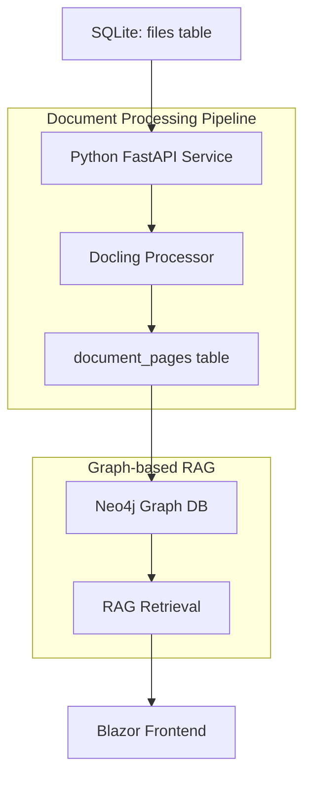

# RAG Implementation Plan - Document Processing with Docling

## Overview

This document outlines the implementation plan for Retrieval Augmented Generation (RAG) functionality in AspireAI, focusing on document processing using docling and Neo4j as the graph repository for advanced retrieval strategies.

**Implementation Status: ? Phase 1-3 COMPLETED (Schema Simplified), Phase 4-5 IN PROGRESS**

## Architecture Overview



## Technology Stack

- **Document Processing**: Docling (Python) ? **IMPLEMENTED**
- **API Layer**: FastAPI (Python) ? **IMPLEMENTED**
- **Graph Database**: Neo4j (Container) ? **IMPLEMENTED**
- **Frontend**: Blazor (.NET 10) ? **EXISTING**
- **Orchestration**: .NET Aspire ? **CONFIGURED**
- **Database**: SQLite (Unified Schema) ? **SIMPLIFIED**

---

## ? Phase 1: Simplified Database Schema - **COMPLETED**

### 1.1 Unified Schema Design

**Key Improvement**: Consolidated from 4+ tables to **2 tables** for clarity and maintainability.

#### **files** table - Single Source of Truth

```sql
CREATE TABLE files (
    id INTEGER PRIMARY KEY AUTOINCREMENT,
    
    -- Core file identification
    file_name TEXT NOT NULL,
    original_file_name TEXT NOT NULL,
    file_path TEXT NOT NULL,
    file_hash TEXT NOT NULL DEFAULT '',
    
    -- File metadata
    file_size INTEGER NOT NULL DEFAULT 0,
    mime_type TEXT,
    
    -- Upload tracking
    uploaded_at DATETIME DEFAULT CURRENT_TIMESTAMP,
    
    -- Processing lifecycle: uploaded ? processing ? processed | error
    status TEXT NOT NULL DEFAULT 'uploaded',
    processing_started_at DATETIME,
    processing_completed_at DATETIME,
    processing_error TEXT,
    
    -- Docling processing output
    docling_document_path TEXT,
    total_pages INTEGER,
    
    -- Neo4j integration (Phase 4)
    neo4j_document_node_id TEXT,
    
    -- Future extensibility
    source_type TEXT NOT NULL DEFAULT 'upload',
    source_url TEXT
);

-- Performance indexes
CREATE INDEX idx_files_status ON files(status);
CREATE INDEX idx_files_hash ON files(file_hash);
CREATE INDEX idx_files_uploaded ON files(uploaded_at);
CREATE INDEX idx_files_source_type ON files(source_type);
```

#### **document_pages** table - Page-Level Content

```sql
CREATE TABLE document_pages (
    id INTEGER PRIMARY KEY AUTOINCREMENT,
    file_id INTEGER NOT NULL,
    page_number INTEGER NOT NULL,
    content TEXT NOT NULL,
    page_metadata TEXT,  -- JSON
    neo4j_page_node_id TEXT,
    
    FOREIGN KEY (file_id) REFERENCES files(id) ON DELETE CASCADE,
    UNIQUE(file_id, page_number)
);

CREATE INDEX idx_pages_file_id ON document_pages(file_id);
CREATE INDEX idx_pages_file_page ON document_pages(file_id, page_number);
```

**Status**: ? **SIMPLIFIED AND IMPLEMENTED**

### 1.2 Status Lifecycle

Clear, simple progression:

```
uploaded ? processing ? processed
                      ? error
```

| Status | Description | Triggers |
|--------|-------------|----------|
| `uploaded` | File ready for processing | Blazor file upload |
| `processing` | Being processed by docling | Python service starts processing |
| `processed` | Successfully processed | Pages extracted, docling complete |
| `error` | Processing failed | Exception during docling processing |

---

## ? Phase 2: Document Processing Pipeline - **IMPLEMENTED**

### 2.1 Workflow

**Step 1: File Upload (Blazor)**
```csharp
var fileMetadata = new FileMetadata
{
    FileName = uniqueFileName,
    OriginalFileName = originalFileName,
    FilePath = uniqueFileName,
    FileHash = sha256Hash,
    FileSize = fileSize,
    MimeType = contentType,
    Status = "uploaded"
};
await _context.Files.AddAsync(fileMetadata);
await _context.SaveChangesAsync();
```

**Step 2: Detection (Python Service)**
```python
unprocessed = db_service.get_unprocessed_files()
# Returns files where status='uploaded'
```

**Step 3: Processing (Python Service)**
```python
# Mark as processing
db_service.update_file_status(file_id, 'processing')

# Process with docling
result = docling_service.process_document(file)

# Save results
db_service.update_file_processing_results(
    file_id=file_id,
    docling_path=result['docling_path'],
    total_pages=len(result['pages'])
)

# Save pages
for page in result['pages']:
    db_service.save_document_page(
        file_id=file_id,
        page_number=page['number'],
        content=page['text'],
        metadata=page.get('metadata')
    )

# Mark complete
db_service.update_file_status(file_id, 'processed')
```

**Status**: ? **WORKFLOW IMPLEMENTED**

---

## ? Phase 3: FastAPI Implementation - **COMPLETED**

### 3.1 Core Database Methods (Python)

```python
class DatabaseService:
    # File management
    def get_file_by_id(file_id: int) -> Dict
    def get_all_files() -> List[Dict]
    def get_unprocessed_files() -> List[Dict]
    def update_file_status(file_id: int, status: str, error: str = None)
    def update_file_processing_results(file_id, docling_path, total_pages, neo4j_node_id)
    
    # Page management
    def save_document_page(file_id, page_number, content, metadata, neo4j_node_id)
    def get_document_pages(file_id: int) -> List[Dict]
    def get_page_by_number(file_id: int, page_number: int) -> Dict
```

**Status**: ? **FULLY IMPLEMENTED**

### 3.2 API Endpoints

**Document Management** (`routers/documents.py`):
```python
? GET    /documents/                    # List all files
? GET    /documents/unprocessed         # Get files ready for processing
? GET    /documents/{file_id}           # Get specific file
? GET    /documents/{file_id}/status    # Get processing status
? GET    /documents/{file_id}/pages     # Get all pages for file
```

**Document Processing** (`routers/processing.py`):
```python
? POST   /processing/process-document/{file_id}  # Process specific file
? GET    /processing/status/{file_id}           # Get processing status
? POST   /processing/process-all                # Process all unprocessed
? GET    /processing/processed-documents        # List processed files
```

**RAG Endpoints** (`routers/rag.py`):
```python
? GET    /rag/search-documents              # Search document content
? GET    /rag/document-context/{file_id}    # Get full document context
? GET    /rag/page-content/{file_id}/{page} # Get specific page
? POST   /rag/semantic-search               # Semantic search (future)
? GET    /rag/health                        # Health check
```

**Status**: ? **COMPLETE REST API**

---

## ? Phase 4: Neo4j Integration - **READY FOR IMPLEMENTATION**

### 4.1 Graph Schema

**Node Types**:
- `Document`: Represents the file/document
- `Page`: Represents individual pages

**Relationship Types**:
- `CONTAINS`: Document contains pages
- `PRECEDES`: Sequential page relationships

**Implementation**:
```python
# After docling processing completes
neo4j_service = Neo4jService()

# Create document node
doc_node_id = neo4j_service.create_document_node(file_dict)
db_service.update_file_processing_results(
    file_id=file_id,
    docling_path=docling_path,
    total_pages=total_pages,
    neo4j_node_id=doc_node_id  # ?? Link to graph
)

# Create page nodes
for page in pages:
    page_node_id = neo4j_service.create_page_node(
        page_content=page['content'],
        page_number=page['page_number'],
        metadata=page.get('metadata')
    )
    
    # Update document_pages with Neo4j node ID
    # (store in neo4j_page_node_id column)