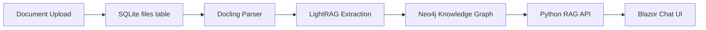

# AspireAI Architecture

## System Overview

AspireAI converts uploaded documents into a structured, version-aware knowledge graph that powers retrieval-augmented chat. The platform is orchestrated through .NET Aspire and combines a Blazor frontend, Python processing backend, and Neo4j graph database.

### High-Level Data Flow

```
Upload (Blazor) → SQLite metadata → Docling parse (Python) → LightRAG extraction → Neo4j graph → RAG retrieval → Chat response with citations
```



---

## Current State (What Exists)

### Implemented ✅

- **Aspire Orchestration** — `AppHost.cs` wires 6 services with health checks, wait-for ordering, environment variable propagation, and bind-mounted volumes.
- **Blazor Chat UI** — Conversation interface with user/assistant message bubbles, speech-to-text, text-to-speech, auto-scroll.
- **AI Integration** — Ollama serving local LLMs, connected via Semantic Kernel.
- **File Upload** — Drag-and-drop upload component; metadata persisted in SQLite (`files` table), physical files stored with timestamped filenames.
- **Python Service** Containerized — FastAPI application with routers for documents, processing, RAG, and health. Docling integration for PDF/DOCX parsing.
- **Neo4j Container** — Provisioned with bind mounts for data, logs, plugins, config.
- **Volume Strategy** — Bind mounts expose uploaded files and SQLite database to the Python container at runtime.

### In Progress ⏳

- **Processing Pipeline** — Docling extracts page content; persistence to `document_pages` table being stabilized.
- **Contract Alignment** — Python router/service/database contracts aligning to canonical `files` + `document_pages` schema.
- **LightRAG Integration** — Container orchestrated but not yet wired into Python retrieval path.

### Planned 🔮

- **RAG Chat Retrieval** — Web chat queries Python `/rag` endpoint; responses include source citations (file, page, snippet).
- **Knowledge Graph Queries** — Structured entity/claim/concept retrieval from Neo4j.
- **Change Detection** — Semantic diffing between document versions.
- **Multi-Agent Reasoning** — Agentic workflows over the knowledge graph.

---

## Component Architecture

### Service Map

| Service | Technology | Responsibility |
|---------|------------|----------------|
| `AspireApp.AppHost` | .NET Aspire | Orchestration, config propagation, container lifecycle |
| `AspireApp.Web` | Blazor (.NET 10) | Chat UI, file upload, speech I/O |
| `AspireApp.ApiService` | Minimal API | Placeholder (vestigial; future API gateway) |
| `AspireApp.PythonServices` | FastAPI (Python) | Document processing, RAG retrieval, Neo4j integration |
| Neo4j | Docker container | Knowledge graph storage |
| Ollama | Docker container | Local LLM inference (chat + embeddings) |
| LightRAG | Docker container | Knowledge extraction (pending integration) |

### Dependency Chain

```
webfrontend
├── WaitFor: ollama, neo4jDb, pythonServices
├── Env: AI-Endpoint, AI-Model, NEO4J_*
└── References: apiService, ollama, appmodel

pythonServices
├── WaitFor: neo4jDb
├── BindMount: data/, database/
└── Env: NEO4J_URI, NEO4J_USER, NEO4J_PASSWORD, ASPIRE_DB_PATH

ollama
├── DataVolume, GPUSupport
└── Models: chat, embedding

lightrag (pending integration)
├── WaitFor: ollama, neo4jDb
└── BindMount: data/
```

---

## Data Architecture

### SQLite Schema (Canonical)

The canonical relational schema uses two tables shared between C# (EF Core) and Python (raw SQL):

**`files`** — Upload metadata

| Column | Type | Notes |
|--------|------|-------|
| `id` | INTEGER PK | Auto-increment |
| `file_name` | TEXT | Timestamped stored filename |
| `original_file_name` | TEXT | User-facing display name |
| `file_path` | TEXT | Directory path to stored file |
| `file_size` | INTEGER | Bytes |
| `content_type` | TEXT | MIME type |
| `source_type` | TEXT | `upload` |
| `status` | TEXT | Lifecycle: `uploaded` → `processing` → `processed` / `error` |
| `upload_date` | TEXT | ISO timestamp |
| `processing_date` | TEXT | Set when processing begins |
| `processed_date` | TEXT | Set on completion |
| `processing_error` | TEXT | Error details if failed |

**`document_pages`** — Extracted page content

| Column | Type | Notes |
|--------|------|-------|
| `id` | INTEGER PK | Auto-increment |
| `file_id` | INTEGER FK | References `files.id` |
| `page_number` | INTEGER | 1-based page index |
| `content` | TEXT | Extracted text |
| `metadata` | TEXT | JSON — section, layout info |
| `neo4j_node_id` | TEXT | Graph node reference |

### Neo4j Knowledge Graph Schema (Target)

The graph stores extracted knowledge as structured nodes and relationships:

**Core Node Types:**

| Node | Purpose | Key Properties |
|------|---------|----------------|
| Tenant | Organization workspace | `tenantId`, `name` |
| Work | Logical document grouping | `workId`, `title` |
| Document | Uploaded file instance | `documentId`, `versionNumber`, `isLatest` |
| Claim | Extracted declarative statement | `text`, `confidence` |
| Evidence | Source passage supporting a claim | `text`, `pageNumber`, `section` |
| Concept | Abstract idea or principle | `name`, `description` |
| Entity | Named real-world object | `name`, `type` (person, org, etc.) |
| ChangeSet | Delta between document versions | `summary`, `createdAt` |

**Key Relationships:**

```
(Tenant)-[:OWNS]->(Work)-[:HAS_DOCUMENT]->(Document)
(Document)-[:SUPERSEDED_BY]->(Document)
(Claim)-[:EXTRACTED_FROM]->(Document)
(Claim)-[:SUPPORTED_BY]->(Evidence)
(Claim)-[:RELATES_TO]->(Concept)
(Claim)-[:MENTIONS]->(Entity)
(ChangeSet)-[:COMPARES]->(Document)
(ChangeSet)-[:ADDED_CLAIM | REMOVED_CLAIM | MODIFIED_CLAIM]->(Claim)
```

**Versioning:** Soft-supersede model — old versions remain in the graph with `isLatest: false`. Claims are always linked to the version they were extracted from, enabling historical reasoning and contradiction detection.

**Tenant Isolation:** All nodes inherit tenant ownership via `(Tenant)-[:OWNS]->(Work)` chains. The API layer enforces access boundaries.

---

## Design Principles

1. **Structured Knowledge Over Text Chunks** — The graph stores entities, claims, and relationships rather than raw text, enabling reasoning instead of just retrieval.
2. **Traceability** — Every AI response must trace back to a source document, version, and page. An answer without provenance is a failure.
3. **Version Awareness** — Document changes are tracked through supersede relationships and change sets, not overwrites.
4. **Minimal Python Footprint** — Python handles document processing and RAG retrieval only. Keep the API surface small: upload → process → retrieve.
5. **Conflict Awareness** — The system should flag when new content contradicts existing claims in the knowledge graph.
6. **Evidence-Based Scoring** — Retrieval prioritizes results by combining semantic similarity with graph centrality.

---

## Future Architecture (Target)

### Knowledge Extraction Pipeline

```
Upload → Docling Parse → LightRAG Entity/Claim/Relationship Extraction → Neo4j Storage → Change Detection → Knowledge API
```

### Multi-Agent Reasoning

- **Triage Agent** — Routes queries based on domain intent.
- **Reasoning Agent** — Validates logic using `CONTRADICTS` and `EVIDENCE` edges.
- **Provenance** — Every response includes `chunk_id` and `version_id` for explainability.
- Agents interact via structured JSON, not raw text.

### Multi-Tenant Strategy

Logical root-node scoping: every tenant gets a `(:Tenant)` root node. All downstream nodes link back to it. The service layer injects tenant filtering into Cypher traversals.

---

**Last Updated:** 2026-02-27
