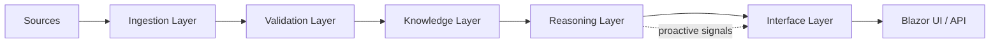

# BRAIN Architecture — AspireAI

## Product Vision

BRAIN (Balanced Reasoning and Adaptive Intelligence Network) is a domain-agnostic agentic knowledge assistant. It ingests diverse sources, scores their trustworthiness, builds an expanding knowledge base, and acts as a proactive advisor — suggesting insights, flagging contradictions, and offering context unprompted, like a personal Jarvis.

BRAIN is not a chat app with document search. It is a **modular AI cognition layer** where chat is one interface over a reasoning engine that knows what it knows, how well it knows it, and can think ahead.

### Core Behaviors

1. **Knowledge Coalescing** — Ingests documents, web content, and other sources into a unified knowledge graph with source-aware confidence scoring (textbook > website > unverified)
2. **Proactive Intelligence** — Suggests related knowledge, flags contradictions, and offers context without being asked
3. **Evidence-Based Responses** — Every answer traces to source material with confidence scores and provenance
4. **Domain Agnostic** — The core is not specialized; domain behavior emerges from the knowledge it ingests and the agents that reason over it
5. **Pluggable & Extensible** — Retrieval backends, data connectors, validators, and agents are swappable behind stable contracts

### High-Level Data Flow

```
Ingest → Normalize → Validate (confidence scoring) → Store (graph + vector) → Reason (agents) → Respond (with evidence + proactive suggestions)
```


```mermaid
flowchart LR
    A[Sources] --> B[Ingestion Layer]
    B --> C[Validation Layer]
    C --> D[Knowledge Layer]
    D --> E[Reasoning Layer]
    E --> F[Interface Layer]
    F --> G[Blazor UI / API]
    E -.->|proactive signals| F
```

---

## Architecture Layers

BRAIN is organized into five service layers. Each layer has defined contracts and responsibilities. Communication flows through structured JSON with tenant_id, correlation_id, and confidence metadata.

### Layer Summary

| Layer | Responsibility | Implementation | Status |
|-------|---------------|----------------|--------|
| **Ingestion** | Parse sources, normalize to CanonicalDocument | Python FastAPI (existing `processing.py`, `docling_service.py`) | ~40% — file ingestion works; no connector architecture yet |
| **Validation** | Claim extraction, confidence scoring, contradiction detection | Python FastAPI (NEW module) | 0% |
| **Knowledge** | Graph + vector storage, retrieval, source tracking | Python FastAPI (existing `neo4j_service.py` + new vector) | ~25% — Neo4j exists; schema needs extension; no vector indexes |
| **Reasoning** | Agent orchestration, multi-step thinking, proactive signals | Python (NEW module — LangGraph or equivalent) | 0% |
| **Interface** | API gateway, routing, auth, response formatting | C# Minimal API (repurposed `ApiService`) + Blazor | ~30% — chat UI exists; no gateway; no structured responses |

### Layer Contracts

Every inter-layer call carries:
- `tenant_id` — Tenant isolation (designed from day 1, enforced later)
- `correlation_id` — Distributed tracing across service calls
- `confidence` — Numeric score (0.0–1.0) propagated through the pipeline
- `source_refs` — List of source documents, pages, and evidence supporting the data

### Layer 1: Ingestion

Accepts diverse sources and normalizes them into `CanonicalDocument` format.

**Current:** Docling parsing for PDF/DOCX, markdown export, SQLite operational tracking. Works for file upload.

**Target:**
- Connector architecture — pluggable source handlers (file upload, URL fetch, API import)
- Normalization pipeline — all sources produce `CanonicalDocument` regardless of origin
- Source trustworthiness tagging — source type determines initial confidence floor (e.g., published textbook = 0.9, web scrape = 0.5, user note = 0.3)
- Operational metadata stays in SQLite (`files` table) — this is pipeline state, not knowledge

### Layer 2: Validation

Examines normalized documents and extracts structured knowledge with confidence scores.

**Current:** Nothing exists.

**Target:**
- Claim extraction — identify declarative statements from document content using LLM
- Confidence scoring — assign scores based on source trustworthiness, cross-reference support, internal consistency
- Contradiction detection — compare new claims against existing knowledge graph
- Evidence linking — connect claims to source passages with page/section references
- Output: `ValidatedDocument` with claims, evidence, confidence scores, and contradiction flags

### Layer 3: Knowledge

Persistent storage and retrieval of validated knowledge.

**Current:** Neo4j with Document→Page graph. LightRAG as separate entity extraction tool. No vector indexes under application control.

**Target:**
- Neo4j knowledge graph with BRAIN schema (see Data Architecture below)
- Neo4j vector indexes for semantic retrieval (eliminates need for separate vector DB)
- LightRAG as a pluggable retrieval backend behind `IKnowledgeRetriever` abstraction
- Confidence-aware retrieval — results ranked by combined graph relevance + semantic similarity + confidence
- Source attribution on every retrieval result

### Layer 4: Reasoning

Agent orchestration — the "thinking" layer that makes BRAIN agentic.

**Current:** Semantic Kernel in Blazor used only for basic chat completion. No agent infrastructure.

**Target:**
- Agent framework in Python (LangGraph, CrewAI, or equivalent — decision pending)
- Agent types:
  - **Retriever** — queries Knowledge Layer with confidence-aware ranking
  - **Synthesizer** — combines multiple knowledge results into coherent responses
  - **Critic** — evaluates response quality, identifies gaps, scores confidence
  - **Planner** — decomposes complex questions into reasoning steps
  - **Proactive Monitor** — watches knowledge state, generates unsolicited insights and suggestions
- Multi-step reasoning — agents collaborate on complex queries
- Tool use — agents call Knowledge and Validation services as tools
- Session memory — conversation context persists across turns

### Layer 5: Interface

The gateway between users and BRAIN's reasoning engine.

**Current:** Blazor chat UI talks directly to Ollama. ApiService is a weather stub.

**Target:**
- **API Gateway** (C# Minimal API, repurposed from `ApiService`) — unified entry point for all BRAIN interactions
  - `POST /brain/chat` — conversational interface with evidence + proactive suggestions
  - `POST /brain/ingest` — trigger document ingestion
  - `POST /brain/query` — structured knowledge query
  - `GET /brain/insights` — proactive suggestions and contradiction alerts
- **Blazor Frontend** — chat UI enhanced with confidence indicators, source citations, and proactive suggestion panel
- Uses `Microsoft.Extensions.AI` (`IChatClient`, `IEmbeddingGenerator`) for LLM abstractions — not full Semantic Kernel
- All responses include confidence scores, source references, and reasoning traces

---

## Service Architecture

### Service Map (Current → Target)

| Service | Current Role | BRAIN Role |
|---------|-------------|-----------|
| `AspireApp.AppHost` | Aspire orchestration | Same — extended for new services/config |
| `AspireApp.Web` | Blazor chat UI + file upload | Interface Layer (UI) — talks to Gateway only |
| `AspireApp.ApiService` | Weather stub (dead code) | **Interface Layer (Gateway)** — BRAIN API entry point |
| `AspireApp.PythonServices` | Monolith (processing + Neo4j + RAG) | Internally decomposed into BRAIN layer packages |
| Neo4j | Document→Page graph | Knowledge graph + vector indexes |
| Ollama | LLM chat | Cross-cutting LLM (Reasoning, Validation, Ingestion) |
| LightRAG | Knowledge extraction | Pluggable retrieval backend (behind abstraction) |

### Python Service Internal Architecture

The Python monolith is decomposed into **internal packages** with clear boundaries. Services extract into separate Aspire containers only when contracts stabilize.

```
src/AspireApp.PythonServices/
├── app/
│   ├── brain/                    # NEW — BRAIN layer packages
│   │   ├── ingestion/            # Connectors, normalization, CanonicalDocument
│   │   ├── validation/           # Claim extraction, confidence scoring
│   │   ├── knowledge/            # Neo4j + vector, retrieval, storage
│   │   └── reasoning/            # Agent orchestration, planning, proactive
│   ├── contracts/                # NEW — Shared data contracts (Pydantic models)
│   │   ├── canonical_document.py
│   │   ├── validated_document.py
│   │   ├── knowledge_result.py
│   │   └── reason_response.py
│   ├── routers/                  # Existing — HTTP endpoint layer
│   ├── services/                 # Existing — to be migrated into brain/ packages
│   └── models/                   # Existing — to be replaced by contracts/
```

### Aspire Orchestration (AppHost.cs)

```
AppHost (Aspire)
├── Web Frontend (Blazor) ─── talks to ──→ Gateway only
├── API Gateway (C# Minimal API) ─── routes to ──→ Python BRAIN services
├── Python BRAIN Service (FastAPI) ─── internally decomposed
│   ├── Ingestion endpoints
│   ├── Validation endpoints
│   ├── Knowledge endpoints
│   └── Reasoning endpoints
├── Neo4j (container) ─── graph + vector storage
├── Ollama (container) ─── LLM inference
└── LightRAG (container) ─── pluggable retrieval backend
```

### Dependency Chain (Target)

```
webfrontend
├── WaitFor: gateway
└── References: gateway

gateway (repurposed ApiService)
├── WaitFor: brainService, ollama
├── References: brainService
└── Env: AI-Endpoint, AI-Model, BRAIN_SERVICE_URL

brainService (Python)
├── WaitFor: neo4jDb, ollama
├── BindMount: data/, database/
├── Env: NEO4J_URI, NEO4J_USER, NEO4J_PASSWORD, ASPIRE_DB_PATH, OLLAMA_ENDPOINT
└── Env: LIGHTRAG_URL (optional — pluggable backend)

neo4jDb (container)
├── Volumes: data, logs, plugins
└── Config: vector index support enabled

ollama (container)
├── DataVolume, GPUSupport
└── Models: chat, embedding
```

---

## Data Architecture

### SQLite — Operational Metadata

SQLite remains the pipeline state store. It tracks what was uploaded, what's being processed, and what failed. It is NOT the knowledge store.

**`files`** — Upload tracking (unchanged)

| Column | Type | Notes |
|--------|------|-------|
| `id` | INTEGER PK | Auto-increment |
| `tenant_id` | TEXT | Tenant identifier (designed day 1; single default value initially) |
| `file_name` | TEXT | Timestamped stored filename |
| `original_file_name` | TEXT | User-facing display name |
| `file_path` | TEXT | Directory path to stored file |
| `file_size` | INTEGER | Bytes |
| `content_type` | TEXT | MIME type |
| `source_type` | TEXT | `upload`, `url`, `api` |
| `source_confidence` | REAL | Initial confidence floor based on source type (0.0–1.0) |
| `status` | TEXT | Lifecycle: `uploaded` → `processing` → `validated` → `stored` / `error` |
| `upload_date` | TEXT | ISO timestamp |
| `processing_date` | TEXT | Set when processing begins |
| `processed_date` | TEXT | Set on completion |
| `processing_error` | TEXT | Error details if failed |

**`document_pages`** — Extracted page content (intermediate — Ingestion output)

| Column | Type | Notes |
|--------|------|-------|
| `id` | INTEGER PK | Auto-increment |
| `file_id` | INTEGER FK | References `files.id` |
| `page_number` | INTEGER | 1-based page index |
| `content` | TEXT | Extracted text |
| `metadata` | TEXT | JSON — section, layout info |
| `neo4j_node_id` | TEXT | Graph node reference (once stored in Knowledge Layer) |

### Neo4j — Knowledge Graph + Vector Indexes

The graph stores validated, structured knowledge. Vector indexes on Neo4j 5.x provide semantic retrieval without a separate vector database.

**Schema Evolution Strategy:** Keep existing Document/Page nodes as ingestion output. Add BRAIN-specific node labels (Claim, Evidence, Concept, Entity) alongside them as the Validation Layer creates them. Don't migrate — extend.

**Core Node Types:**

| Node | Purpose | Key Properties |
|------|---------|----------------|
| `Tenant` | Workspace root | `tenantId`, `name` |
| `Document` | Ingested source instance | `documentId`, `tenantId`, `filename`, `sourceType`, `sourceConfidence`, `versionNumber`, `isLatest` |
| `Page` | Document page (ingestion output) | `pageId`, `documentId`, `pageNumber`, `content` |
| `Claim` | Extracted declarative statement | `claimId`, `text`, `confidence`, `extractedAt` |
| `Evidence` | Source passage supporting a claim | `evidenceId`, `text`, `pageNumber`, `section` |
| `Concept` | Abstract idea or principle | `conceptId`, `name`, `description` |
| `Entity` | Named real-world object | `entityId`, `name`, `type` (person, org, etc.) |
| `Embedding` | Vector representation | `embeddingId`, `vector` (float[]), `sourceNodeId` |

**Key Relationships:**

```
(Tenant)-[:OWNS]->(Document)
(Document)-[:HAS_PAGE]->(Page)
(Document)-[:SUPERSEDED_BY]->(Document)
(Claim)-[:EXTRACTED_FROM]->(Document)
(Claim)-[:SUPPORTED_BY]->(Evidence)
(Claim)-[:RELATES_TO]->(Concept)
(Claim)-[:MENTIONS]->(Entity)
(Claim)-[:CONTRADICTS]->(Claim)
```

**Vector Indexes:** Created on `Embedding.vector` and `Claim.text` properties for semantic retrieval. Queries combine graph traversal (follow relationships) with vector similarity (semantic matching) for confidence-aware results.

**Tenant Isolation (Day-1 Design):**
- All nodes carry `tenantId` property
- All queries include tenant filter parameter
- `(Tenant)-[:OWNS]->(Document)` relationship chain provides graph-level isolation
- Enforcement deferred — single default tenant initially; multi-tenant enforcement in Phase 6

### LightRAG — Pluggable Retrieval Backend

LightRAG continues to operate as a self-contained RAG system behind an abstraction. It is NOT the primary knowledge path.

```
IKnowledgeRetriever (interface)
├── BrainKnowledgeRetriever (primary — Neo4j graph + vector, confidence-aware)
└── LightRAGRetriever (pluggable — uses existing LightRAG container)
```

LightRAG writes its own nodes/relationships to Neo4j. These are separate from BRAIN's knowledge schema. The application does not control LightRAG's graph structure. This is acceptable as long as LightRAG remains behind the abstraction and is not the system of record for BRAIN knowledge.

---

## Design Principles

1. **Knowledge Quality Over Quantity** — The system scores how well it knows something. A textbook claim at 0.9 confidence outranks a web scrape at 0.5. Answers without provenance are failures.
2. **Proactive Intelligence** — BRAIN doesn't wait to be asked. It monitors knowledge state, detects contradictions, and suggests related context during conversations.
3. **Traceability** — Every response traces to source documents, pages, claims, and confidence scores. The reasoning path is visible.
4. **Source-Aware Confidence** — Confidence propagates through the pipeline: source type → extraction quality → cross-reference support → retrieval ranking.
5. **Pluggable Architecture** — Retrieval backends, data connectors, validators, and agent types are swappable behind stable interfaces. LightRAG is one implementation of `IKnowledgeRetriever`, not a dependency.
6. **Tenant-Ready Contracts** — Every data contract includes `tenant_id`. Isolation enforcement is deferred, but contracts never block it.
7. **Test at Every Seam** — Each BRAIN layer is independently testable. QA is built into the development process, not bolted on after.
8. **Architecture Right** — Extensibility and maintainability over speed. The system is designed to evolve, not to ship fast and rewrite later.

---

## Technology Decisions

| Decision | Choice | Rationale |
|----------|--------|-----------|
| Agent framework | Python (LangGraph/CrewAI/custom) | Richer AI agent ecosystem; keeps reasoning close to knowledge services |
| C# AI abstractions | Microsoft.Extensions.AI (MEai) | Lightweight `IChatClient`/`IEmbeddingGenerator`; SK is overkill for gateway layer |
| Vector store | Neo4j vector indexes | Fewer moving parts; graph + vector in one store; swap to Qdrant later if needed |
| Python decomposition | Internal packages first | Clean module boundaries within monolith; extract to separate services when contracts stabilize |
| Multi-tenancy | Day-1 contract design, deferred enforcement | `tenant_id` on every contract prevents painful retrofit; actual isolation built in Phase 6 |
| LightRAG | Pluggable backend behind abstraction | Preserves existing work; BRAIN contracts are primary; can be swapped or deprecated |
| Breaking changes | Feature branch (`brain-pivot`) | Clean separation from stable main; merge when first slice works |

---

## Current State Summary

### Reusable Foundations ✅

- Aspire AppHost orchestration and container wiring
- Docling document parsing (PDF/DOCX → text/markdown)
- Neo4j container with volume management
- Ollama container with GPU support and model management
- SQLite operational schema (`files`, `document_pages`)
- Health check patterns across services
- Volume mount strategy (shared `data/`, `database/`)
- LightRAG proven integration (handoff + query round-trip)

### Needs Redesign 🔄

- Python monolith → internal BRAIN layer packages
- Neo4j schema → extend with Claim/Evidence/Concept/Entity nodes
- Chat integration → route through Gateway → Reasoning → Knowledge (not direct to Ollama)
- ApiService → repurpose as BRAIN API Gateway
- Inter-service communication → add correlation IDs, confidence metadata, structured envelopes

### Must Be Built From Scratch 🆕

- Validation Layer (claim extraction, confidence scoring, contradiction detection)
- Reasoning Layer (agent orchestration, proactive monitoring, multi-step reasoning)
- BRAIN core contracts (CanonicalDocument, ValidatedDocument, KnowledgeResult, ReasonResponse)
- Neo4j vector indexes and embedding pipeline
- Proactive suggestion system
- Agent evaluation and observability framework

---

## References

- `roadmap/Atlas-for-Data-Smart-Brain.md` — Original BRAIN modular architecture specification
- `roadmap/Atlas-deeper-api-implementation-suggestions.md` — BRAIN API contract specifications
- `.squad/decisions/inbox/kujan-arch-review.md` — Adversarial architecture review (2026-07-15)
- `.squad/decisions/inbox/verbal-strategy-review.md` — Strategic product review (2026-07-15)

---

**Last Updated:** 2026-07-15
**Decision Authority:** Eric Van Artsdalen + adversarial review by Kujan (architecture) and Verbal (strategy)
